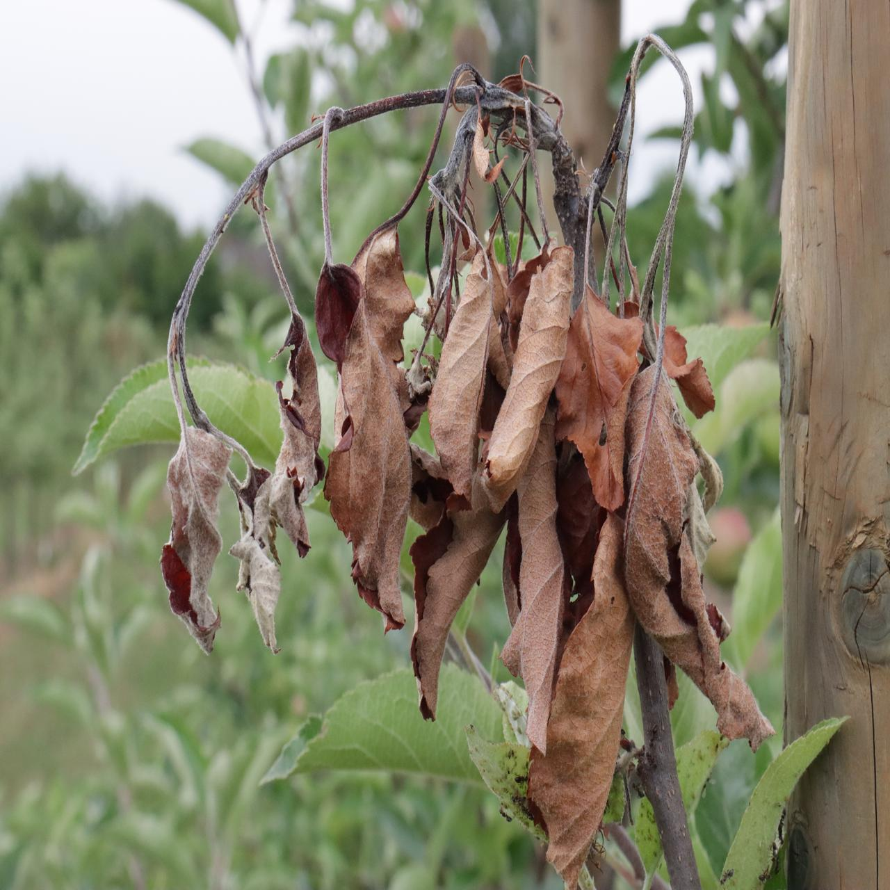
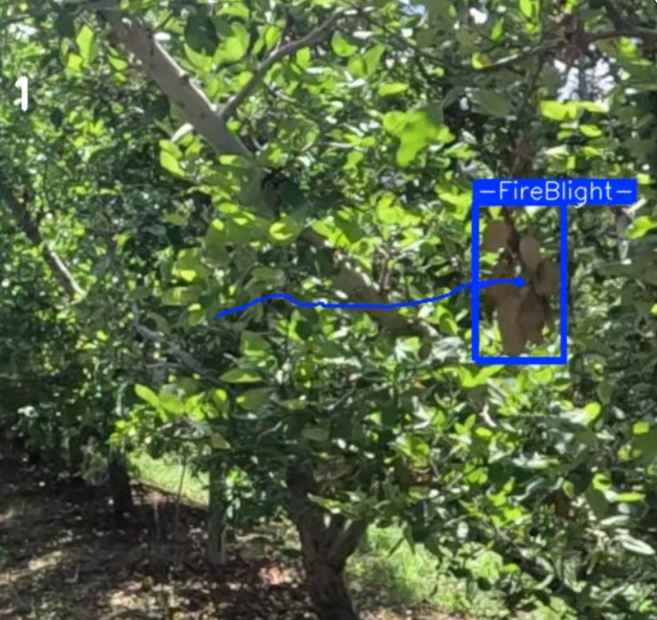

# Fireblight Detection Using Yolov11
Authors:

Fernando Matute and Noel Madrid

## Abstract

This research develops a real-time system for detecting Fireblight (FB) in apple orchards using YOLOv10 and YOLO11 models, integrated with a GoPro Hero 12 Black camera. The camera captures real time video of orchard trees, which are processed using Python and OpenCV for object detection. The system records detected FB occurrences in CSV files, with each event logged by date and time. The models were trained with a diverse dataset of 2726 annotated images, enhanced through data augmentation. 

Performance evaluation showed strong detection accuracy, demonstrating the effectiveness of camera positioning and the system's reliability in real-world conditions. This method offers valuable insights for precision agriculture, contributing to better management of FB disease in orchards.

## Setup to run our implementation

### We recommend use a conda environment:

`conda create -n yolov10 python=3.9`

`conda activate yolov10`

`conda install --file requirements.txt`

You may also create the environment from the requirements file:

`conda create --name <env> --file <this file>`

### Make sure you have your Cuda drivers from:
https://www.nvidia.com/en-us/drivers/

### If your torch and torchvision are not compatible:
Use this command and check in the jupyter notebook

`pip install torch torchvision torchaudio --index-url https://download.pytorch.org/whl/cu121`

### With that you are able to run our fire_blight.ipynb Jupyter to train the model

## Video of our model working
