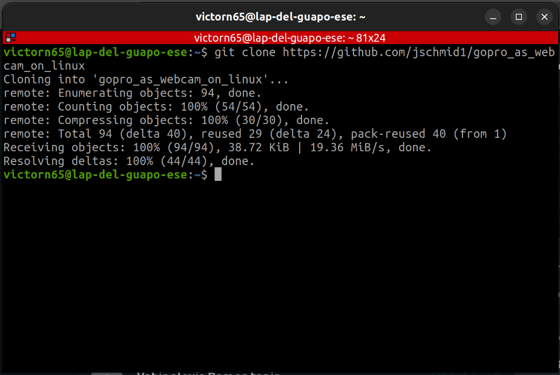
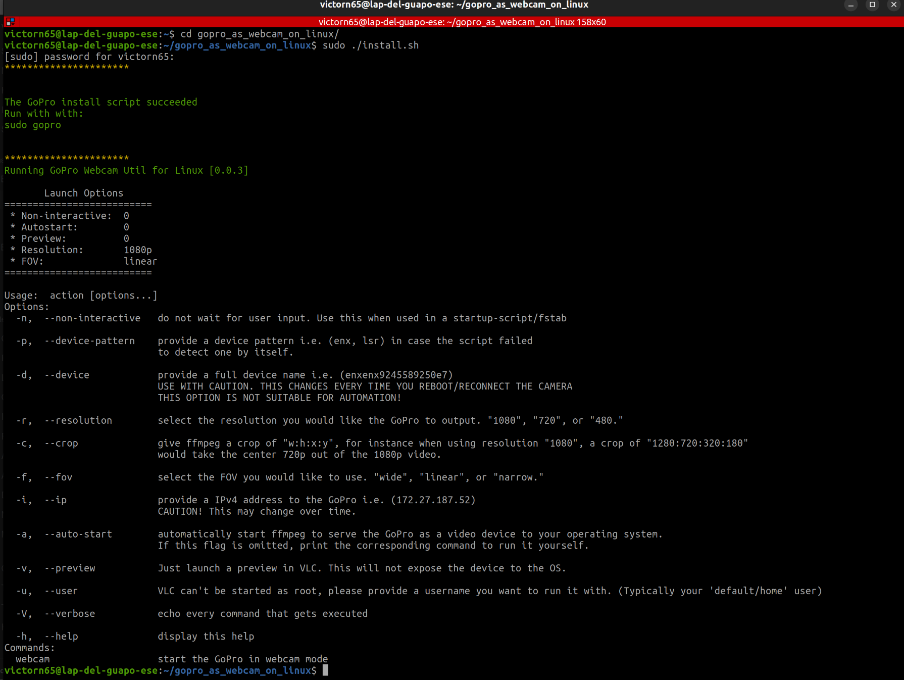
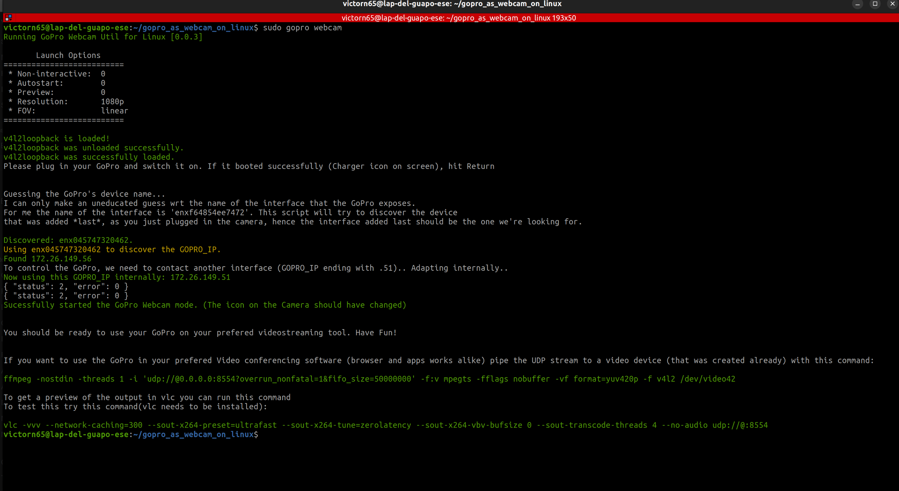
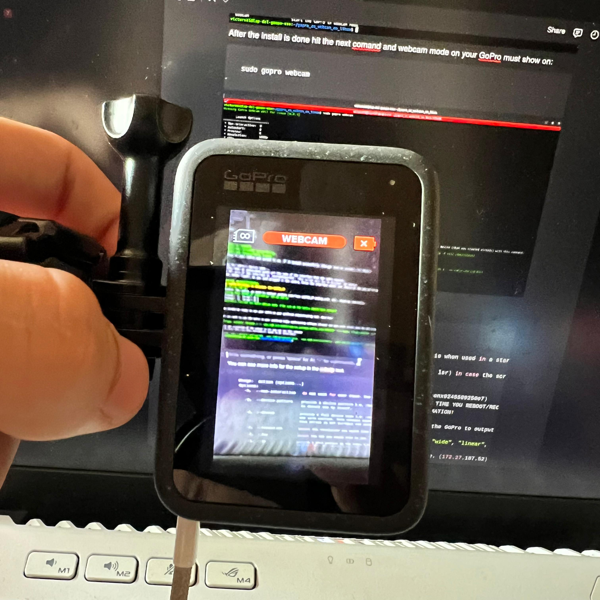

# Camera Setup
This tutorial is to set your camera (GoPro 12 Black) in our case.

### 1. Type this command in your terminal

`git clone https://github.com/jschmid1/gopro_as_webcam_on_linux`

### 2. Then you have to enter the directory and follow the next step:

`sudo ./install.sh`

### 3. After the install is done hit the next comand and webcam mode on your GoPro must show on, remember that the camera must be pluged in (doesn’t matter if it is in the usb-c port and there’s no need for the battery to be in the camera):

`sudo gopro webcam`

### Output:

### Now you can run your model using the camera.py script

## For more information about the repository check out:
https://github.com/jschmid1/gopro_as_webcam_on_linux